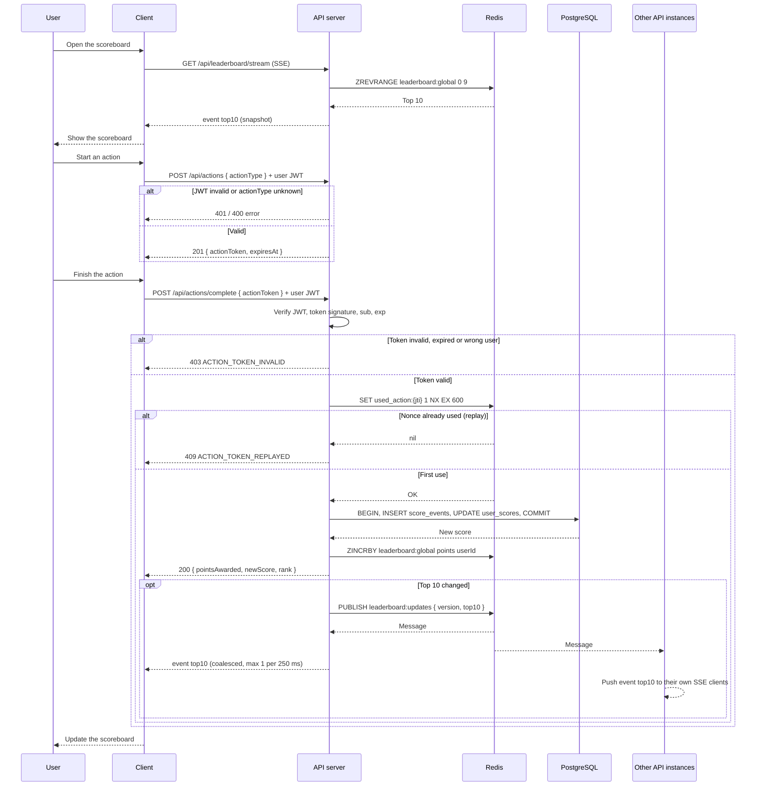

# Problem 6: Scoreboard API module

## Overview

This module handles real-time score updates for a website leaderboard. Users earn points by completing actions, their scores are updated, and the scoreboard shows the **top 10 users** live. This spec is written for the backend team to implement.

## Features

1. **Score update API:** the client starts an action and gets a signed, short-lived token, then completes it to earn points. The server decides the points.
2. **Leaderboard API:** returns the top 10 users by score.
3. **Real-time updates:** pushes scoreboard changes to clients over Server-Sent Events.
4. **Anti-cheat:** only real, authenticated, non-replayed actions can increase a score.

## Assumptions

The brief doesn't say how ties are ranked, so these are my decisions. They should be confirmed with product before implementation.

- **Ranking style for tied scores: `1, 2, 2, 4` (standard competition ranking), not `1, 2, 2, 3` (dense ranking).** A user's rank is 1 + the number of users with a strictly higher score. I think `1, 2, 2, 4` is the more reasonable choice: two users sharing 2nd place means nobody is 3rd, which matches how most games and competitions rank, and a rank always tells you how many people are ahead of you.
- **Order within a tie: whoever reached the score first is listed first.** Instead of a timestamp, each score update gets a number from one database sequence (`achieved_seq`, e.g. the `score_events` id). It always increases, so a smaller `achieved_seq` means the user got there earlier. Unlike timestamps, two updates can never share a value (same second / millisecond), and it doesn't depend on any server's clock.
- **The leaderboard shows exactly 10 users.** If the 10th and 11th users are tied, both have the same rank, but only the one with the smaller `achieved_seq` is shown.
- **Scores only increase.** If they could decrease (penalties, reversed actions), "last update" would no longer mean "when this score was reached", and the tie-break would need revisiting.

## API endpoints

### 1. Update score

**1a. Start an action:** `POST /api/actions` (user JWT required)
The server returns a signed, short-lived action token.

**Request:**

```json
{
  "actionType": "complete_quiz"
}
```

**Response (201):**

```json
{
  "success": true,
  "data": { "actionToken": "eyJhbGciOi…", "expiresAt": "2026-10-04T10:10:00Z" }
}
```

**1b. Complete the action:** `POST /api/actions/complete` (user JWT required)

**Request:**

```json
{
  "actionToken": "eyJhbGciOi…"
}
```

**Response (200):**

```json
{
  "success": true,
  "data": { "pointsAwarded": 10, "newScore": 120, "rank": 7 }
}
```

**Security considerations**

The server accepts a completion only if **all** of these hold:

1. The user's JWT is valid. **The user id always comes from the JWT, never from the body.**
2. The action token's signature is valid, it hasn't expired, and its `sub` matches the authenticated user.
3. (Optional) The minimum duration for that `actionType` has passed since `iat`, so a script can't "finish" instantly.
4. The nonce hasn't been used: `SET used_action:{jti} 1 NX EX 600` in Redis must succeed. Otherwise it's a **replay** and the server returns `409`. The unique `jti` in `score_events` is a second line of defence.

**Points come from a server-side table** (`complete_quiz → 10`), never from the client. Each user is rate-limited (e.g. 30 completions/minute, `429` beyond that).

### 2. Get leaderboard

**Endpoint:** `GET /api/leaderboard` (public)
**Description:** Returns the top 10 users with the highest scores.

**Response:**

```json
{
  "success": true,
  "data": [
    { "rank": 1, "userId": "u_123", "displayName": "Mike", "score": 980 },
    { "rank": 2, "userId": "u_456", "displayName": "Lan", "score": 915 }
  ]
}
```

## Storage

**Redis sorted set (fast reads, the live leaderboard)**

| Operation                                      | Command                                       | Cost          |
| ---------------------------------------------- | --------------------------------------------- | ------------- |
| Add points (atomic, no read-modify-write race) | `ZINCRBY leaderboard:global 10 u_123`         | O(log N)      |
| Top 10                                         | `ZREVRANGE leaderboard:global 0 9 WITHSCORES` | O(log N + 10) |
| A user's rank                                  | `ZREVRANK leaderboard:global u_123`           | O(log N)      |

**PostgreSQL (source of truth)**

| Table          | Columns                                                                  | Notes                                               |
| -------------- | ------------------------------------------------------------------------ | --------------------------------------------------- |
| `user_scores`  | `user_id` PK, `score` int, `updated_at`                                  | index on `score DESC`                               |
| `score_events` | `id`, `user_id`, `action_type`, `points`, `jti` **unique**, `created_at` | append-only: audit trail, and lets us rebuild Redis |

**Write path** (in `POST /api/actions/complete`):

1. In one DB transaction: insert into `score_events` (the unique `jti` rejects replays) and `UPDATE user_scores SET score = score + :points`.
2. After the commit: `ZINCRBY` in Redis and publish the change (see below).

If Redis is lost, it's rebuilt from `user_scores`. If step 2 fails after a commit, a reconciliation job (or an outbox table) re-applies it, so the database stays the source of truth.

**Ties:** see [Assumptions](#assumptions). Tied users share a rank (`1, 2, 2, 4`) and are ordered by `achieved_seq` (smaller = reached the score first). In PostgreSQL that is `ORDER BY score DESC, achieved_seq ASC` with an index on `(score DESC, achieved_seq ASC)`. In the sorted set it can be encoded as `points * 1e10 + (MAX_SEQ - achieved_seq)`.

## Real-time updates

**Transport: Server-Sent Events** (`GET /api/leaderboard/stream`). Data only flows server → client, and SSE gives automatic reconnection over plain HTTP. WebSockets would also work, but there's nothing for the client to send.

1. On connect, the client receives the current top 10 as the first event, so it never shows a stale list.
2. After a successful score update, the server checks whether the top 10 changed: the user's new score is at least the 10th score, or the user was already in it.
3. If it changed, the server publishes `{ version, top10 }` to the Redis channel `leaderboard:updates`.
4. **Every API instance** subscribes to that channel and pushes the event to its own SSE clients. This is what makes it work behind a load balancer.
5. Updates are **coalesced**: at most one push every 250 ms, carrying the latest top 10. A burst of score changes becomes one message.

The payload is the **whole top 10** (10 small rows), not a diff. Clients simply replace their list, and a missed message can't leave them out of sync. The `version` number lets a client ignore out-of-order events.

The stream is public, like the leaderboard. If it had to be private, the JWT would be checked when the connection opens.

## Errors

Every error uses one shape:

```json
{
  "success": false,
  "error": {
    "code": "ACTION_TOKEN_REPLAYED",
    "message": "This action was already completed"
  }
}
```

| Status | Code                    | When                                                      |
| ------ | ----------------------- | --------------------------------------------------------- |
| 400    | `VALIDATION_ERROR`      | Missing or malformed body                                 |
| 401    | `UNAUTHORIZED`          | Missing or invalid user JWT                               |
| 403    | `ACTION_TOKEN_INVALID`  | Bad signature, expired, wrong user, or completed too fast |
| 404    | `ACTION_TYPE_NOT_FOUND` | Unknown `actionType`                                      |
| 409    | `ACTION_TOKEN_REPLAYED` | Nonce already used                                        |
| 429    | `RATE_LIMITED`          | Too many completions                                      |
| 500    | `INTERNAL_ERROR`        | Anything unexpected                                       |

## Execution flow



## Non-functional requirements

- Score update: p99 < 100 ms. Leaderboard read: p99 < 20 ms (served from Redis).
- API instances are stateless; SSE fan-out goes through Redis pub/sub.
- The database is the source of truth; Redis can be rebuilt from it.

## Improvement suggestions

1. **Outbox pattern:** write the "score changed" event in the same DB transaction and publish it from a worker, so Redis and the broadcast can never miss a committed update.
2. **Queue for spikes:** if completions spike, put them on a queue (BullMQ/SQS/Kafka) and apply them asynchronously; the client gets `202 Accepted`.
3. **Fraud signals:** use `score_events` to flag unusual patterns (too many completions, impossible timings) for review instead of only hard limits.
4. **Periodic leaderboards:** daily/weekly boards as extra sorted sets (`leaderboard:2026-W40`) with a TTL.
5. **Load test** the SSE fan-out (e.g. k6) before launch to size instances.
